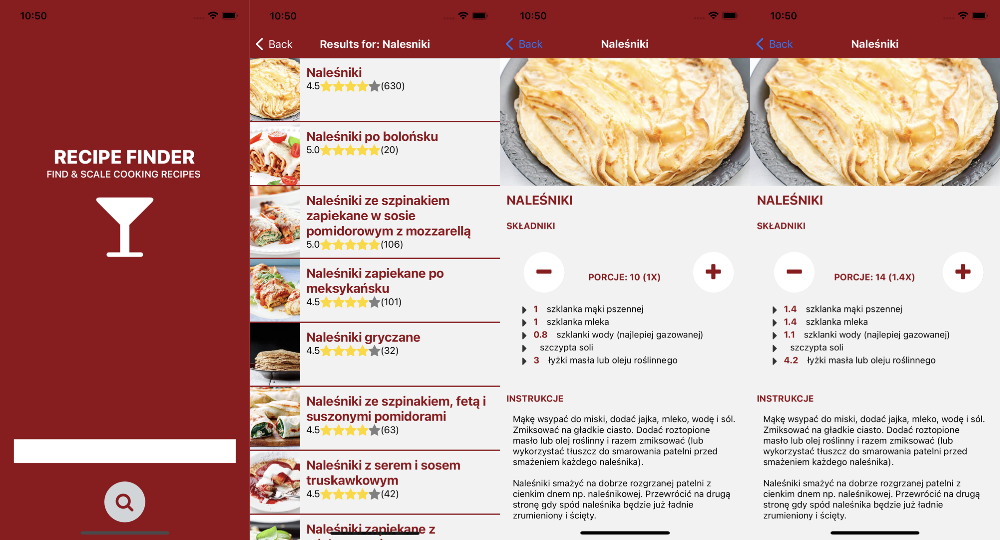

<h1 style="color: #920918; text-align: center; font-weight: bold; text-transform: uppercase;">Recipe Finder</h1>
<h2 style="text-align: center; font-weight: bold; text-transform: uppercase;">Find & scale cooking recipes</h2>

## Idea

- User enters one or more ingredients,
- Server returns list of matching recipes,
- User selects wanted recipe
- Ingredients amounts are calculated based on input amount or wanted portions (if portion info in recipe)

## Screenshots



## Details

- API
  - how to find matching recipes
    - google it on supported websites
    - scrape selected website
    - build cached recipe database while scraping (WIP)

## Dependencies

- recipe scraping: [https://github.com/hhursev/recipe-scrapers]

## Limitations

- google search api free plan has a daily quota of 100 requests

## How to run

### API

```bash
#Prepare environment
cd scraper
python -m venv env
source env/bin/activate
pip install -r requirements.txt

#Create .env file in scraper dir containing env vars:
printf '%s\n' 'google_search_api_key=xxxx' 'google_search_api_id=xxxx.' > .env

#Run API:
python main.py
```

### React native

```bash
#Install dependencies:
cd recipeFinder
npm i

#Run the app using iOS/Android simulator:
npm run ios
#or
npm run android
```

## Disclaimers

- this project is made for educational purposes
- all data presented by this app scraped from the web
